# Backend Simple WMS

## Mockups Design: [FIGMA](https://www.figma.com/file/xZU0wwbhsbLdGLpCO6QFCP/Vuex?node-id=19%3A48)

## Api Documentation

-
-
-

### Sign Up

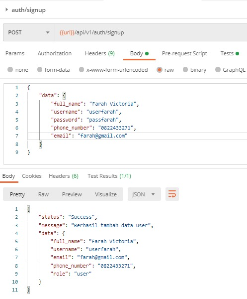

### Login

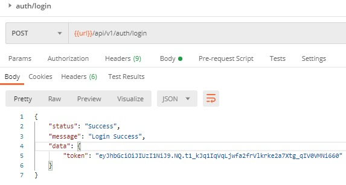

-
-
-

# GET

## Note: Untuk Endpoint dibawah ini, butuh 'token' Authorization dari login

-

### Get All Products

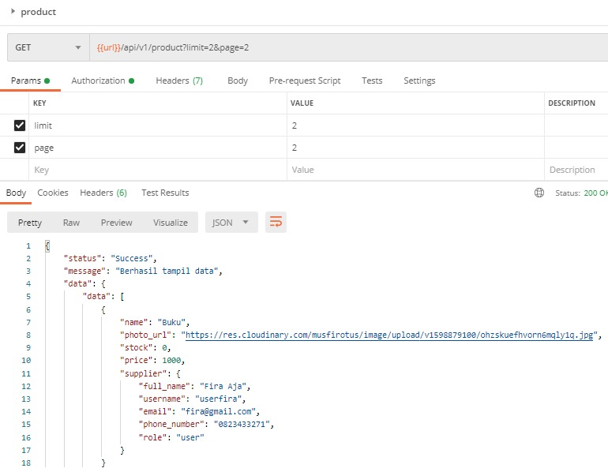

### Get All Products IN

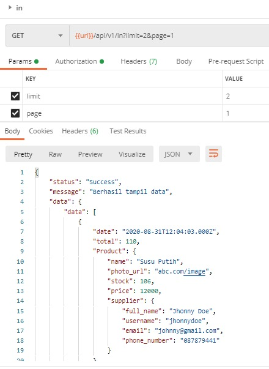

### Get All Products OUT

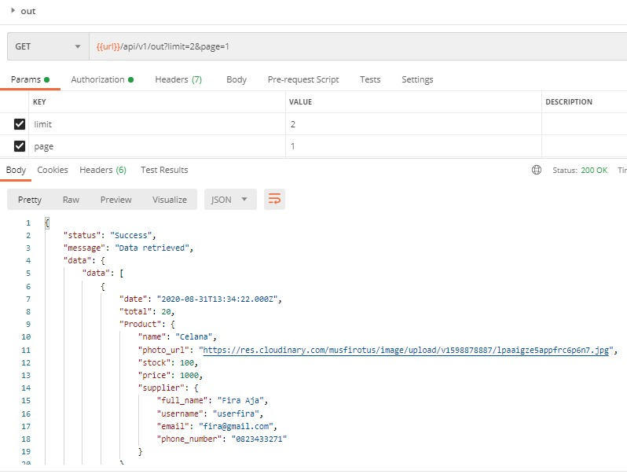

### Get User By id

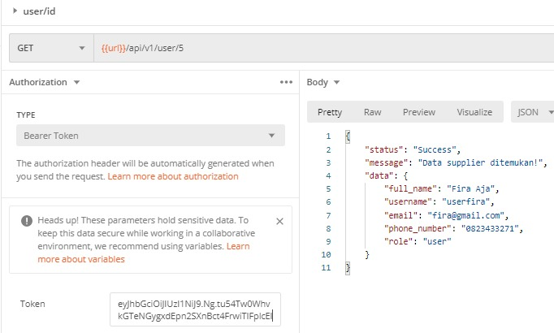

### Get Products By id

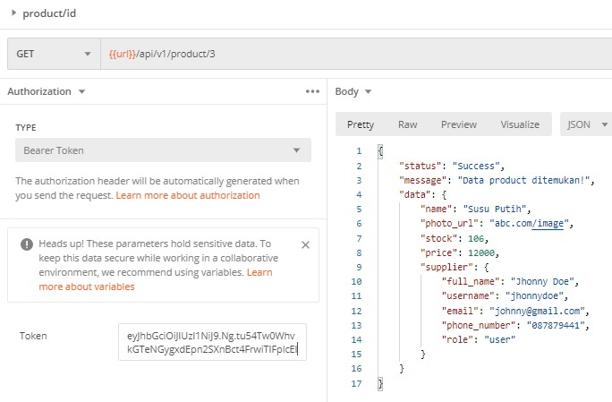

### Get Products IN By id

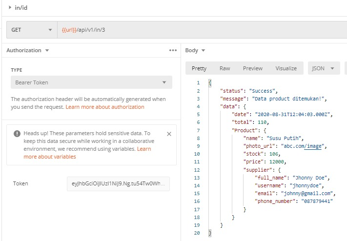

### Get Products OUT By id

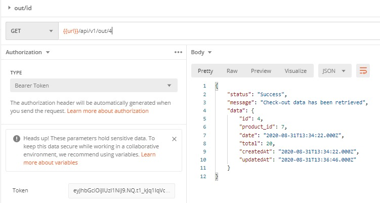

-
-
-

# POST

### POST User

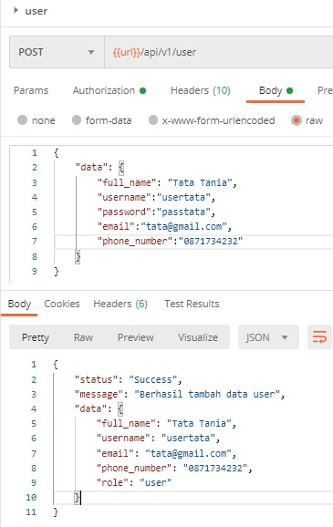

### POST Product

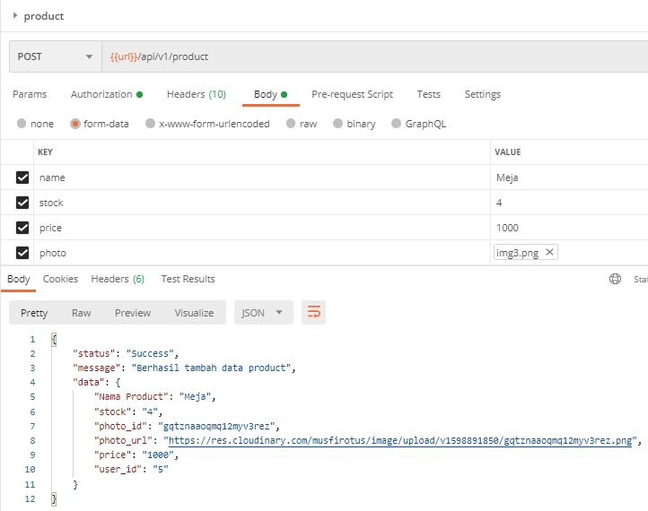

### POST Product IN

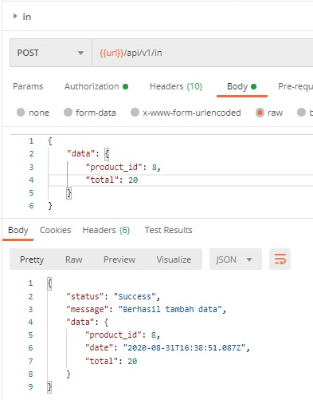

### POST Product OUT

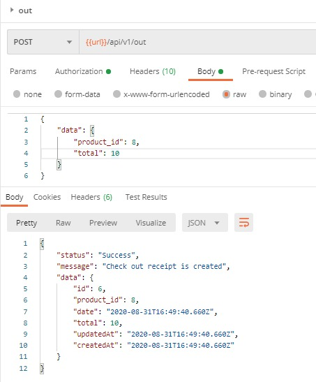

-
-
-

# PUT

### PUT - Update User By Id

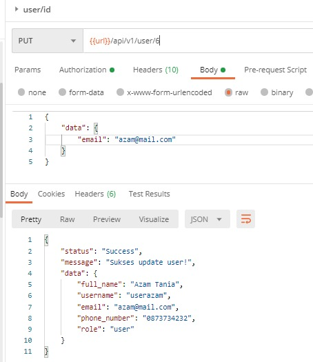

### PUT - Update Product By Id

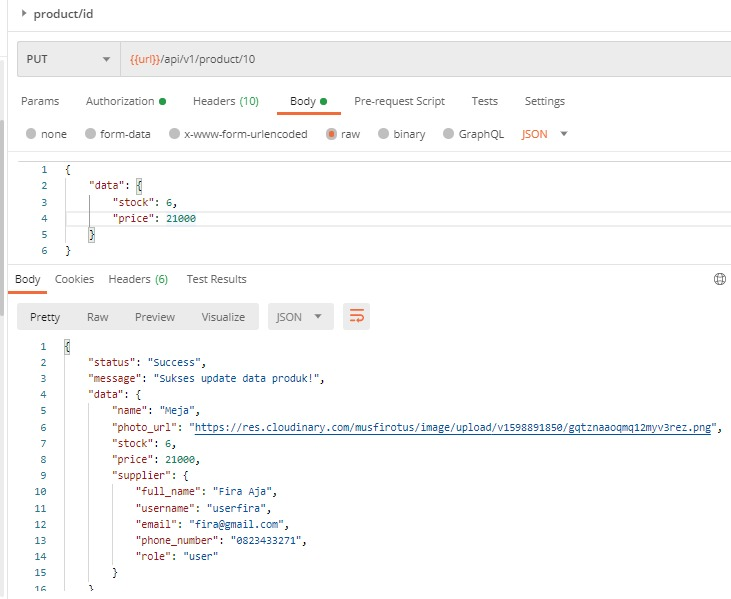

### PUT - Update Product IN By Id

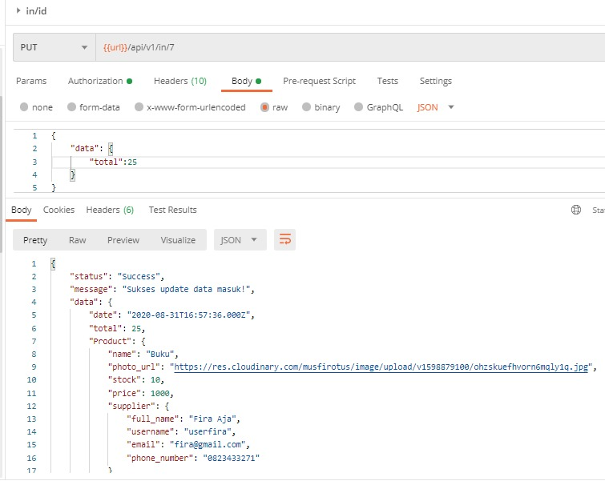

### PUT - Update Product OUT By Id

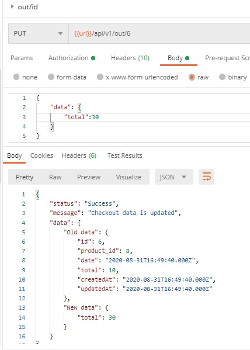

-
-
-

# DELETE

### DELETE User By id

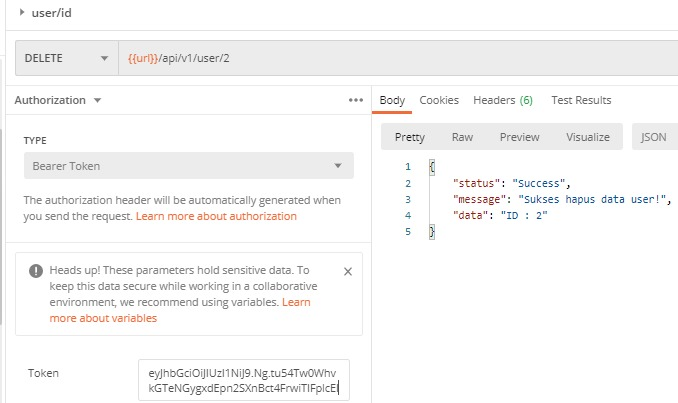

### DELETE Product By id

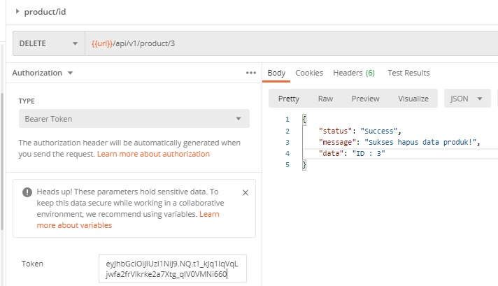

### DELETE Product IN By id

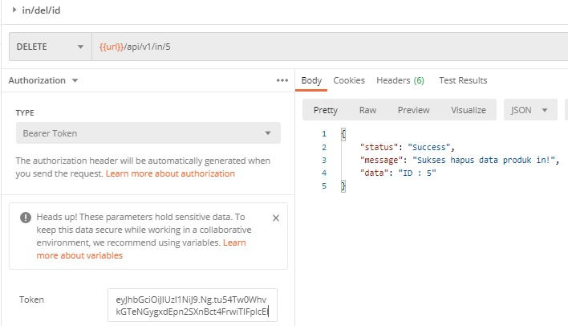

### DELETE Product OUT By id

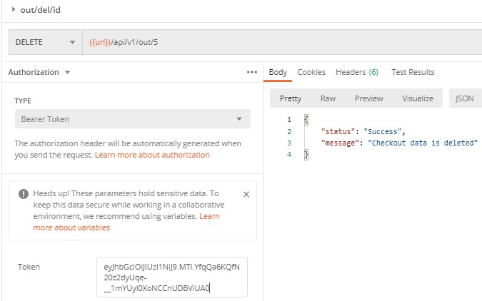

-
-
-

# HIT Endpoint for Download

### Download Laporan Product IN

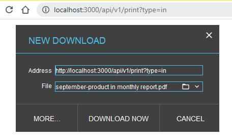

### Download Laporan Product OUT

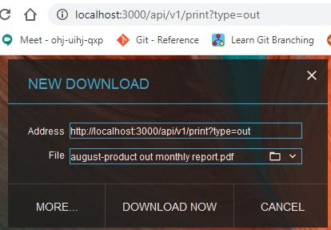

### Download Laporan Product ALL

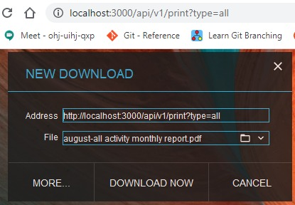
